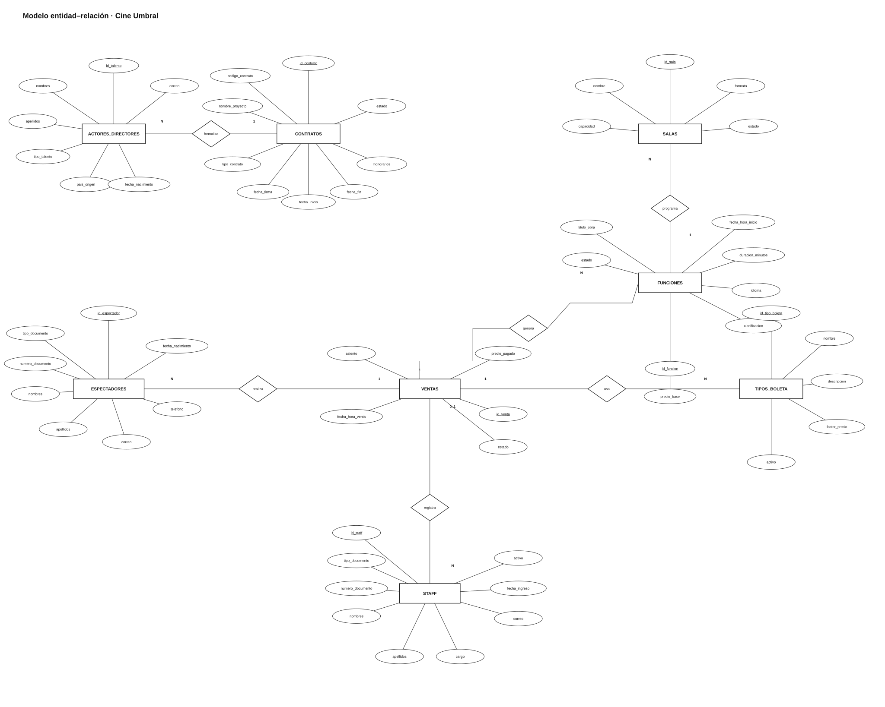

# Modelo entidad–relación · Cine Umbral

- [Ver o descargar el diagrama SVG](modelo-er.svg)
- [Editar la fuente en draw.io](modelo-er.drawio)
- [Consultar el modelo relacional en 3FN](../modelo-relacional/README.md)

El modelo recoge las ocho entidades solicitadas. Las relaciones conceptuales corresponden a las referencias entre tablas definidas en el modelo relacional: actores/directores–contratos, salas–funciones, funciones–ventas, espectadores–ventas, tipos de boleta–ventas y staff–ventas.
