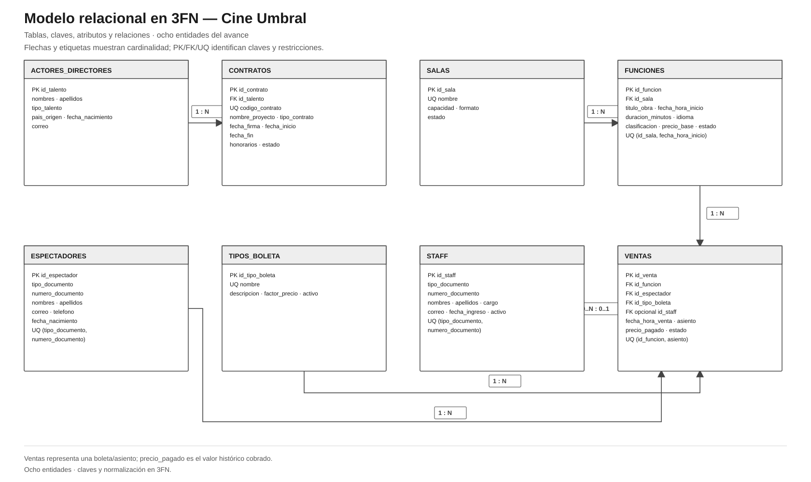

# Modelo relacional en tercera forma normal · Cine Umbral

El diagrama especifica las ocho relaciones con sus claves primarias, foráneas y candidatas. La documentación complementaria explica las restricciones y la normalización.

- [Abrir o descargar diagrama SVG](modelo-relacional-3fn.svg)
- [Editar fuente en draw.io](modelo-relacional-3fn.drawio)
- [Relaciones, claves, restricciones y justificación 3FN](modelo-relacional-3fn.md)

## Decisiones del modelo

- Se conservan exactamente las ocho entidades solicitadas por la guía.
- Una fila de VENTAS representa una boleta para un solo asiento y una sola función. Una compra de varias boletas usa varias filas.
- El precio pagado se guarda como valor histórico. La tarifa base pertenece a la función y el factor pertenece al tipo de boleta.
- `id_staff` puede ser nulo cuando la venta se hace en línea; las ventas presenciales pueden asociar a quien las registra.
- Como la guía fija ocho entidades y no incluye PELÍCULAS, FUNCIONES guarda el título de la obra programada.
